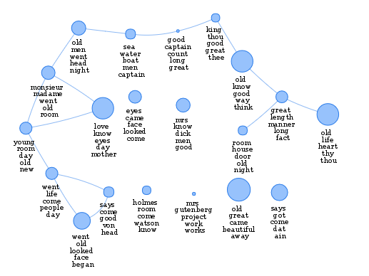
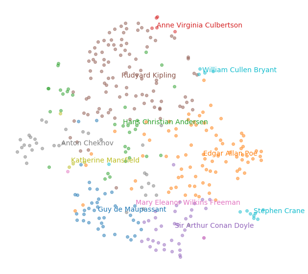
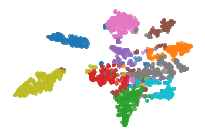

# gutenberg-stories

A collection of short stories from project gutenberg 

STM | ATM
:-------------------------:|:-------------------------:
 |  

LDA        |  HDP  |
:-------------------------:|:-------------------------:
  |  
- bookshelf (Project Gutenberg short-stories bookshelf): 591
- manual (Project Gutenberg catalog search): 994
- sherlock (sherlock canon from https://sherlock-holm.es/): 44
- Total: 1629
